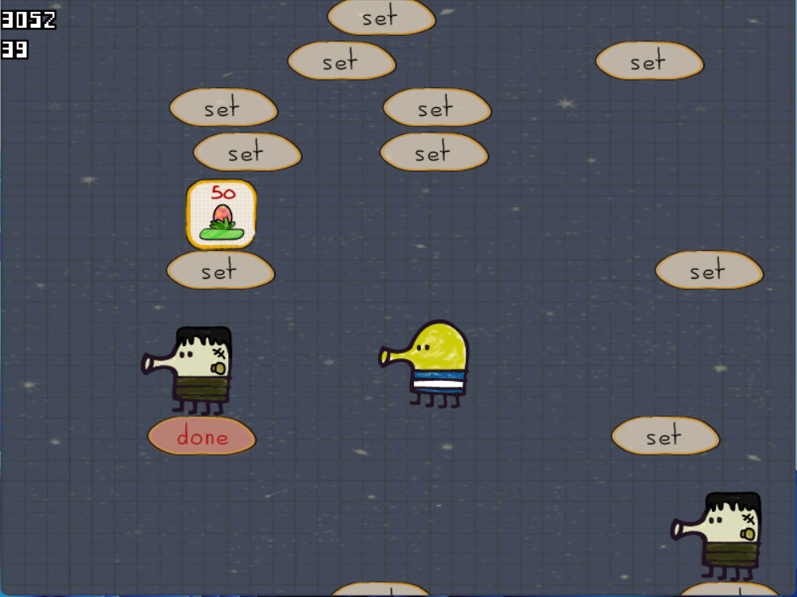
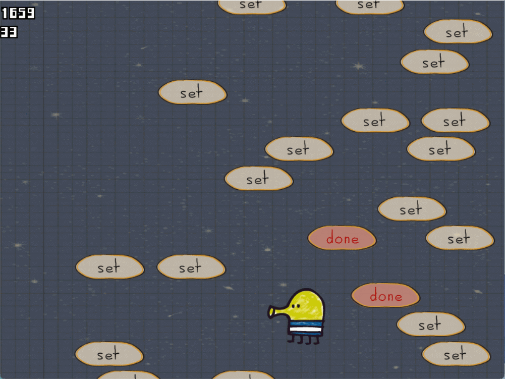
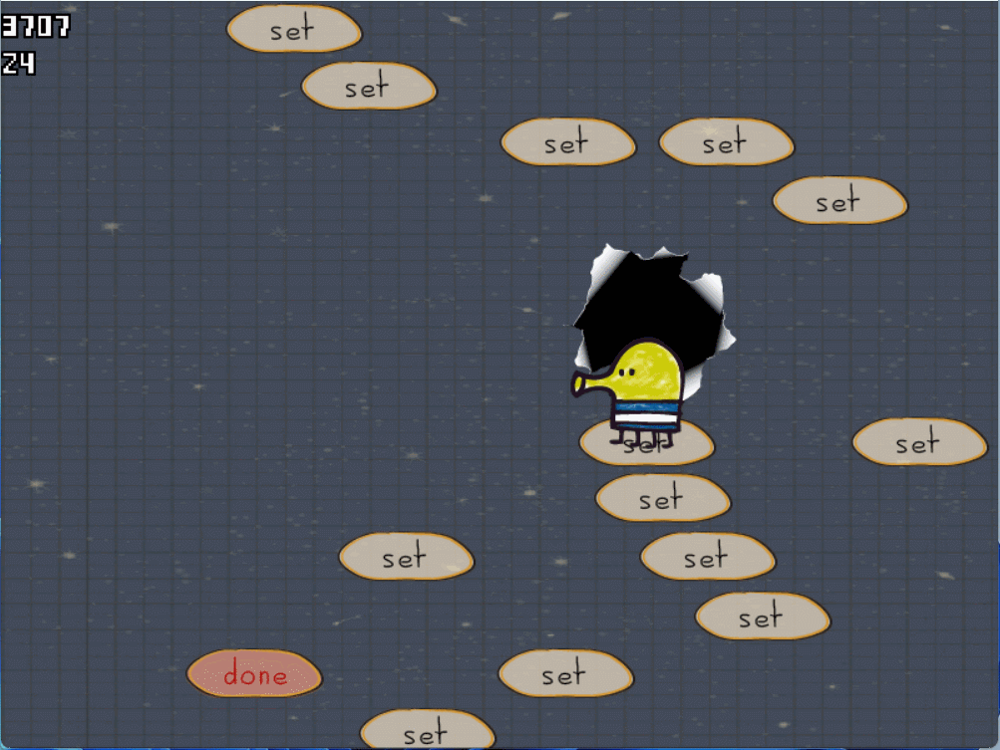
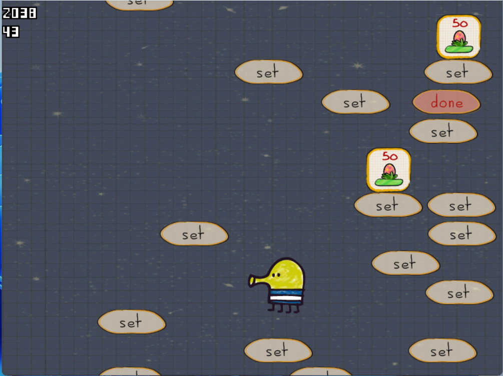
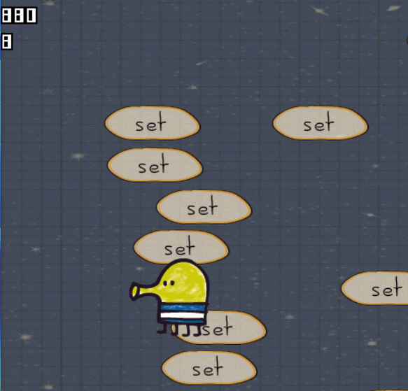
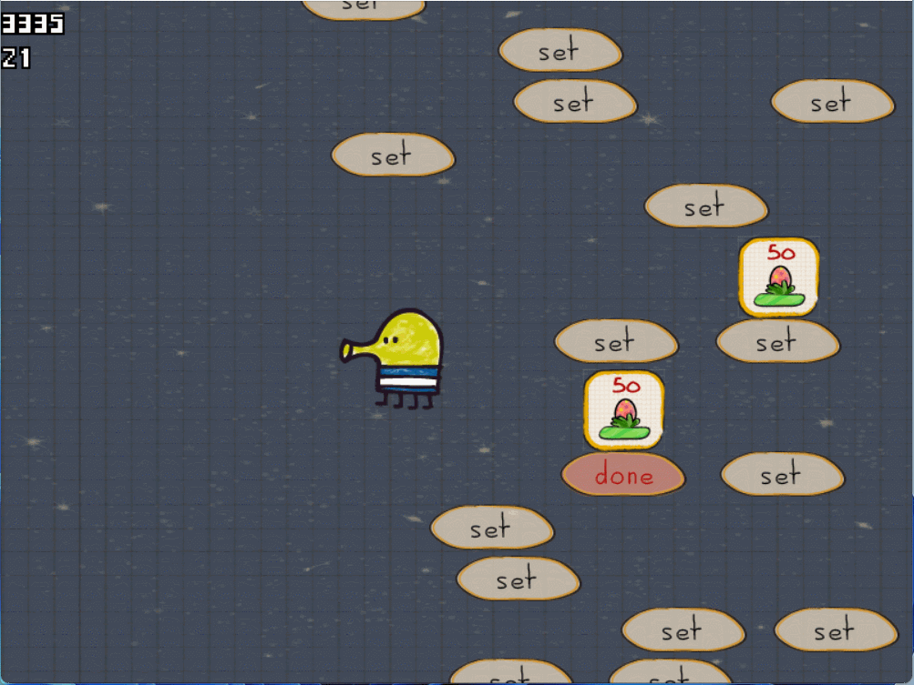

# Doodle Jump Clone

## Table of Contents
- [Overview](#overview)
- [Features](#features)
- [Controls](#controls)
- [Gameplay](#gameplay)
- [Screenshots and Gameplay Demos](#screenshots)
- [Getting Started](#getting-started)
- [Contributing](#contributing)
- [License](#license)

## Overview

Welcome to the Doodle Jump Clone! This game is inspired by the classic Doodle Jump and offers a fun and challenging platforming experience. Jump endlessly, defeat zombies, collect power-ups, and aim for the highest score!

## Features

### Endless Jumping
- Doodle is constantly jumping off randomly generated tiles, making the game potentially endless.

### Challenging Obstacles
- Avoid falling off the tiles or colliding with zombies to stay alive.

### Score Tracker
- Keep an eye on your current score in the top-left corner of the screen.

### Precise Controls
- Control Doodle's left-right movement with the left and right arrow keys on your keyboard.

### Projectile Shooting
- Left-click the mouse to launch projectiles in the direction you choose. Hold the left mouse button for continuous shooting.

### Zombie Elimination
- Kill zombies by either shooting projectiles at them or jumping on their heads.

### Dynamic Tiles
- Some tiles are painted in red and vanish after a single jump, while others are permanent.

### Black Holes
- Black holes affect Doodle's movement by gravitating it towards them.

### Easter Eggs
- Discover easter eggs randomly scattered across the tiles. Collecting them temporarily changes Doodle's skin to a bunny costume and grants a 2x jump boost.

## Controls

- **Left Arrow**: Move Doodle left.
- **Right Arrow**: Move Doodle right.
- **Left Mouse Click**: Shoot projectiles in the direction of your cursor. Hold for continuous shooting.

## Gameplay

- The game starts with Doodle constantly jumping.
- Avoid falling off the tiles or colliding with zombies to survive.
- Shoot projectiles to eliminate zombies.
- Jump on top of zombies to defeat them.
- Red tiles disappear after a single jump, while others are permanent.
- Black holes affect Doodle's movement.
- Collect easter eggs to transform into a bunny and gain a 2x jump boost for a limited time.

## Screenshots and Gameplay Demos

### Gameplay Screenshot

*Doodle in action, jumping on tiles.*

### Zombie Encounter

*Doodle encountering a zombie.*

### Projectile Shooting

*Doodle shooting projectiles at zombies.*

### Tile Types

*Permanent (green) and disappearing (red) tiles.*

### Black Hole Effect

*Doodle affected by a black hole.*

### Easter Egg Collecting

*Doodle collecting an easter egg.*

### High Score

*Top left corner with the current score.*

### Skin Transformation

*Doodle in a bunny costume after collecting an easter egg.*

## Getting Started

To run the game, follow these steps:

1. Clone this repository to your local machine.
2. Open the game folder.
3. Run the game executable (if available) or open the project in your preferred game development environment.

## Contributing

We welcome contributions to enhance the game or fix issues. Feel free to submit pull requests or report bugs.

## License

This project is licensed under the [MIT License](LICENSE).
